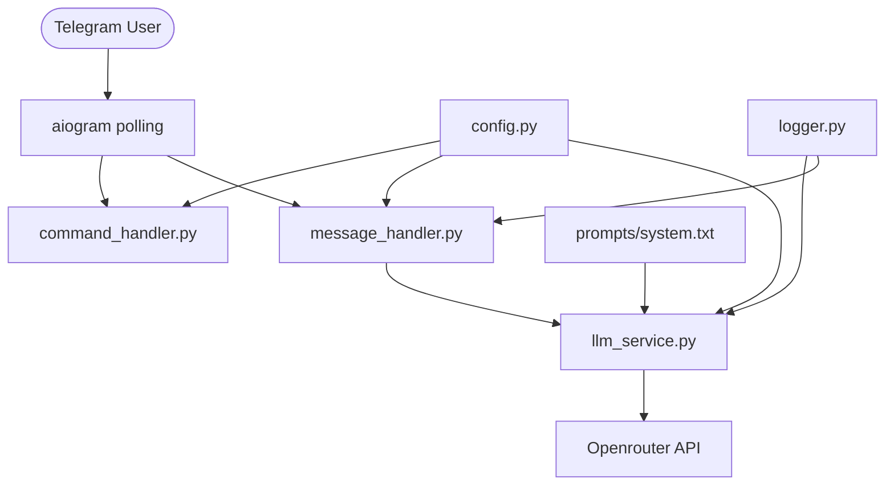

# Реализация Telegram-бота (MVP)

## Архитектура



## Файлы к созданию

- [`pyproject.toml`](pyproject.toml) — зависимости: `aiogram`, `openai`, `pydantic-settings`, `python-dotenv`, `ruff`
- [`Makefile`](Makefile) — таргеты: `install`, `run`, `lint`, `format`
- [`.env.example`](.env.example) — шаблон всех переменных окружения
- [`.gitignore`](.gitignore) — исключить `.env`, `__pycache__`, `.venv`
- [`bot/__init__.py`](bot/__init__.py)
- [`bot/main.py`](bot/main.py) — инициализация `Bot`, `Dispatcher`, запуск polling
- [`bot/config.py`](bot/config.py) — `Config(BaseSettings)`, fail fast при отсутствии переменных
- [`bot/utils/logger.py`](bot/utils/logger.py) — настройка `logging`, формат с `asctime | level | name | message`
- [`bot/services/llm_service.py`](bot/services/llm_service.py) — `LlmService`: история в памяти, скользящее окно 20 сообщений, вызов OpenRouter
- [`bot/handlers/message_handler.py`](bot/handlers/message_handler.py) — текстовые сообщения → `LlmService.chat()`, нетекстовые → отказ
- [`bot/handlers/command_handler.py`](bot/handlers/command_handler.py) — `/start`, `/help`, `/reset`
- [`bot/prompts/system.txt`](bot/prompts/system.txt) — системный промпт: роль бота-ассистента курса

## Ключевые детали реализации

**`Config`** (pydantic-settings, читает `.env`):
```python
telegram_token: str
openrouter_api_key: str
openrouter_model: str = "openai/gpt-4o-mini"
openrouter_base_url: str = "https://openrouter.ai/api/v1"
openrouter_timeout: int = 30
system_prompt_path: str = "bot/prompts/system.txt"
max_history_size: int = 20
log_level: str = "INFO"
```

**`LlmService.chat(chat_id, text) -> str`**:
- Добавляет `user`-сообщение в историю
- Обрезает историю до `max_history_size`
- Строит запрос: `[system] + history`
- При ошибке API — логирует, откатывает историю, возвращает текст ошибки

**Логирование** — `chat_id` только в виде хэша (`hashlib.sha256`).

**`system.txt`** — промпт описывает бота как ассистента курса AI-driven fullstack developer, знающего `README.md` и `PROGRAM.md`.
