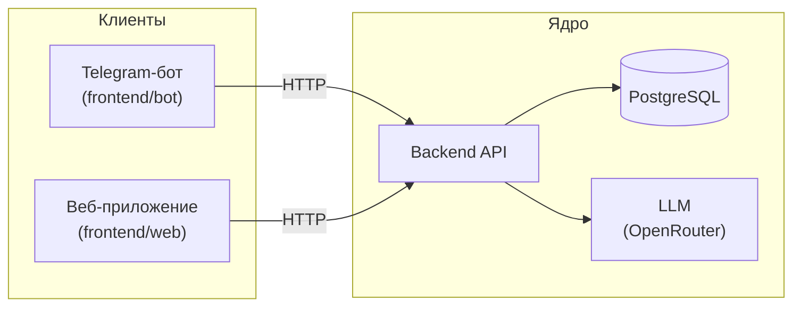

# LLMStart — Система сопровождения учебного потока

Платформа помощи студентам и преподавателю курса **AI-driven Fullstack Developer**: навигация по программе, ответы по содержанию, фиксация прогресса.

> Учебный проект курса. Разрабатывается участниками потока в рамках программы.

## О проекте

Студенты курса теряют ориентиры: где материалы, что дальше, как зафиксировать результат.  
Система даёт единую точку входа через Telegram-бота (сейчас) и веб-кабинет (следующий этап).  
Ключевые пользователи: **студент** — навигация и прогресс; **преподаватель** — обзор потока.

## Архитектура



Бизнес-логика живёт только в `backend/`. Бот и веб — тонкие клиенты без уникальных правил.

## Статус

| # | Итерация | Статус |
|---|----------|--------|
| 1 | MVP: Telegram-бот (LLM, история в памяти) | ✅ Done |
| 2 | Backend API (scaffold, LLM, прогресс, поток) | ✅ Done |
| 3 | База данных (PostgreSQL, схема, миграции) | 📋 Planned |
| 4 | Frontend (веб-кабинет студента и преподавателя) | 📋 Planned |
| 5 | Интеграция клиентов (бот + веб → backend API) | 📋 Planned |
| 6 | Dev&Ops & Production (CI/CD, контейнеры, деплой) | 📋 Planned |

## Документация

- [Идея продукта](docs/idea.md)
- [Архитектурное видение](docs/vision.md)
- [Модель данных](docs/data-model.md)
- [Интеграции](docs/integrations.md)
- [План](docs/plan.md)
- [Задачи](docs/tasks/)

## Быстрый старт

Нужен [uv](https://docs.astral.sh/uv/) (корень и `backend/` синхронизируются через lock-файлы).

В **Linux/macOS** или при установленном [GNU Make](https://www.gnu.org/software/make/) удобны цели из [Makefile](Makefile). В **Windows** (PowerShell/cmd) команда `make` часто отсутствует — используйте команды из раздела [ниже](#windows-no-make) или поставьте Make (например [Chocolatey: `make`](https://community.chocolatey.org/packages/make), пакет MSYS2, Git Bash с make, [WSL](https://learn.microsoft.com/windows/wsl/)).

**Перед PR:** из корня выполните `make install`, затем `make lint` и `make test` (или [эквиваленты без make](#windows-no-make)). На GitHub те же шаги гоняет workflow [`.github/workflows/ci.yml`](.github/workflows/ci.yml).

<a id="windows-no-make"></a>

### Запуск без make (Windows)

Из **корня** репозитория — то же, что делают цели `Makefile`:

| Цель `make` | Команды |
|-------------|---------|
| `install` | `uv sync --group dev`, затем в `backend\`: `uv sync --extra dev` |
| `run` | `uv run python -m bot.main` |
| `lint` | `uv run ruff check bot` и `uv run ruff format --check bot`; затем в `backend\`: `uv run ruff check app tests` и `uv run ruff format --check app tests` |
| `format` | `uv run ruff format bot` и `uv run ruff check --fix bot`; затем в `backend\`: `uv run ruff format app tests` и `uv run ruff check --fix app tests` |
| `test` / `test-backend` | в `backend\`: `uv sync --extra dev`, затем `uv run pytest` |
| `migrate-backend` | в `backend\`: `uv sync --extra dev`, затем `uv run alembic upgrade head` |

В **cmd** одной строкой для backend (как в Makefile): `cd backend && uv sync --extra dev && uv run pytest` и `cd backend && uv sync --extra dev && uv run alembic upgrade head`. В **PowerShell 5.1** надёжнее три отдельные строки (`cd backend`, `uv sync ...`, `uv run ...`); в **PowerShell 7+** допустим оператор `&&`.

**Без uv (только рантайм бота):** `python -m pip install -r requirements.txt` — без `ruff` и pytest; для полной проверки качества используйте `uv` и строки выше.

### Backend API

Нужен файл окружения (зависимости — через `make install` или `uv sync` в `backend/`). Конфиг backend ([`backend/app/config.py`](backend/app/config.py)) подхватывает `.env` относительно каталога запуска: обычно `backend/.env` и корневой `.env` (см. `env_file` в `Settings`).

1. Шаблон процесса backend — [`backend/.env.example`](backend/.env.example) (`backend/.env` или объединить с корневым `.env`). Шаблон бота — корневой [`.env.example`](.env.example); при одном `.env` в корне допишите в него строки из `backend/.env.example`.
2. Установить зависимости и запустить сервер из каталога `backend/`:

```bash
cd backend
uv sync
uv run uvicorn app.main:app --host 127.0.0.1 --port 8000
```

`BACKEND_HOST` и `BACKEND_PORT` в `.env` должны совпадать с аргументами `--host` / `--port` у uvicorn.

Для **тестов** и **миграций Alembic** нужен dev-набор: `uv sync --extra dev`.

**База данных:** если `DATABASE_URL` не задан или пустой, используется **SQLite** (`./llmstart_local.sqlite` в текущем каталоге процесса); схема для SQLite создаётся при старте приложения, **отдельный шаг миграций не нужен**. Для **PostgreSQL** задайте `DATABASE_URL` (`postgresql+asyncpg://...`) и из **корня** репозитория выполните **`make migrate-backend`** (внутри: `cd backend && uv sync --extra dev && uv run alembic upgrade head`). На Windows без make — строка **`migrate-backend`** в [таблице выше](#windows-no-make).

**Проверка после запуска:**

- `GET http://127.0.0.1:8000/health` → `{"status":"ok"}` (подставьте свой хост/порт).
- Документация API: **Swagger** `/docs`, машиночитаемая схема **`GET /openapi.json`**, **ReDoc** `/redoc`.
- Публичное API: префикс `/api/v1/`.

**Тесты backend** (из корня): **`make test`** или **`make test-backend`** (одинаковые). На Windows без make — строка **`test`** в [таблице выше](#windows-no-make).

**Линт и формат:** **`make lint`** / **`make format`** — сначала пакет `bot/` (корневой `pyproject.toml`), затем `backend/app` и `backend/tests` (настройки [backend/pyproject.toml](backend/pyproject.toml)). Детали — [backend/README.md](backend/README.md).

### Telegram-бот

Бот ходит только в **backend API** (LLM на стороне ядра). **Запуск** достаточно с `TELEGRAM_TOKEN` и поднятым backend. **`COHORT_ID` и `MEMBERSHIP_ID` не обязательны:** в этом случае используется **guest-режим** (`POST /api/v1/assistant/guest/*`) — диалог в памяти процесса backend, без строк в БД; сценарий позже можно сменить на поток/membership. Если оба UUID заданы и данные есть в БД, запросы идут в основной контракт `.../cohorts/{id}/dialogues/messages` с персистентностью.

**Локально (SQLite):** после первого старта backend файл `llmstart_local.sqlite` появится в каталоге, из которого вы запускали uvicorn (часто `backend/`). Вставьте демо-строки (подставьте свои UUID в `.env` или оставьте эти и скопируйте в `COHORT_ID` / `MEMBERSHIP_ID`):

```sql
INSERT INTO users (id, telegram_user_id, display_name)
VALUES ('11111111-1111-1111-1111-111111111111', NULL, 'Demo');
INSERT INTO cohorts (id, title, code)
VALUES ('22222222-2222-2222-2222-222222222222', 'Demo cohort', 'demo');
INSERT INTO cohort_memberships (id, user_id, cohort_id, role, status)
VALUES (
  '33333333-3333-3333-3333-333333333333',
  '11111111-1111-1111-1111-111111111111',
  '22222222-2222-2222-2222-222222222222',
  'student',
  'active'
);
```

Тогда в `.env`: `COHORT_ID=22222222-2222-2222-2222-222222222222`, `MEMBERSHIP_ID=33333333-3333-3333-3333-333333333333`.

Скопировать корневой [`.env.example`](.env.example) → `.env` и задать **`TELEGRAM_TOKEN`**. **`COHORT_ID` / `MEMBERSHIP_ID`** нужны только для режима с БД (SQL ниже); без них работает guest-LLM через тот же backend. Если включён Bearer для API, добавьте в тот же `.env` **`BACKEND_API_CLIENT_TOKEN`** из [`backend/.env.example`](backend/.env.example) (значение должно совпадать с backend). Параметры LLM для процесса backend — там же в `backend/.env.example` (**`OPENROUTER_API_KEY`** и др.; пустой ключ → заглушка). Из **корня** репозитория:

```bash
make install
make run
```

Без make (Windows): см. [таблицу выше](#windows-no-make) — `install` и `run`.

На MVP один `MEMBERSHIP_ID` в `.env` используется для всех пользователей Telegram; для продакшена нужна отдельная привязка аккаунтов.

`PROXY_URL` в корневом `.env` используется **только для Telegram** (aiogram). Запросы бота к `BACKEND_BASE_URL` идут **напрямую**; отдельный прокси для backend — переменная `BACKEND_HTTP_PROXY` (см. [`.env.example`](.env.example)).

### Полный стек (бот + backend + CI)

Пайплайн **lint + test** на push/PR в ветках `main`/`master` — [`.github/workflows/ci.yml`](.github/workflows/ci.yml). Дорожная карта и итерация Dev&Ops — [`docs/plan.md`](docs/plan.md); задача **08** в [tasklist-backend](docs/tasks/tasklist-backend.md) закрывает единый `Makefile` и CI на уровне репозитория.
