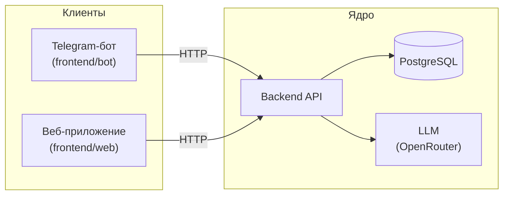

# LLMStart — Система сопровождения учебного потока

Платформа помощи студентам и преподавателю курса **AI-driven Fullstack Developer**: навигация по программе, ответы по содержанию, фиксация прогресса.

> Учебный проект курса. Разрабатывается участниками потока в рамках программы.

## О проекте

Студенты курса теряют ориентиры: где материалы, что дальше, как зафиксировать результат.  
Система даёт единую точку входа через Telegram-бота (сейчас) и веб-кабинет (следующий этап).  
Ключевые пользователи: **студент** — навигация и прогресс; **преподаватель** — обзор потока.

## Архитектура

Бизнес-логика живёт только в `backend/`. Бот и веб — тонкие клиенты без уникальных правил.

## Статус

| # | Итерация | Статус |
|---|----------|--------|
| 1 | MVP: Telegram-бот (LLM, история в памяти) | ✅ Done |
| 2 | Backend API (scaffold, LLM, прогресс, поток) | 📋 Planned |
| 3 | База данных (PostgreSQL, схема, миграции) | 📋 Planned |
| 4 | Frontend (веб-кабинет студента и преподавателя) | 📋 Planned |
| 5 | Интеграция клиентов (бот + веб → backend API) | 📋 Planned |
| 6 | Dev&Ops & Production (CI/CD, контейнеры, деплой) | 📋 Planned |

## Документация

- [Идея продукта](docs/idea.md)
- [Архитектурное видение](docs/vision.md)
- [Модель данных](docs/data-model.md)
- [Интеграции](docs/integrations.md)
- [План](docs/plan.md)
- [Задачи](docs/tasks/)

## Быстрый старт

**Текущая версия (итерация 1 — бот):** скопировать `.env.example` → `.env`, задать `TELEGRAM_TOKEN` и `OPENROUTER_API_KEY`, затем `python -m bot.main`.

Полная инструкция по запуску всего стека появится после итерации 6.
