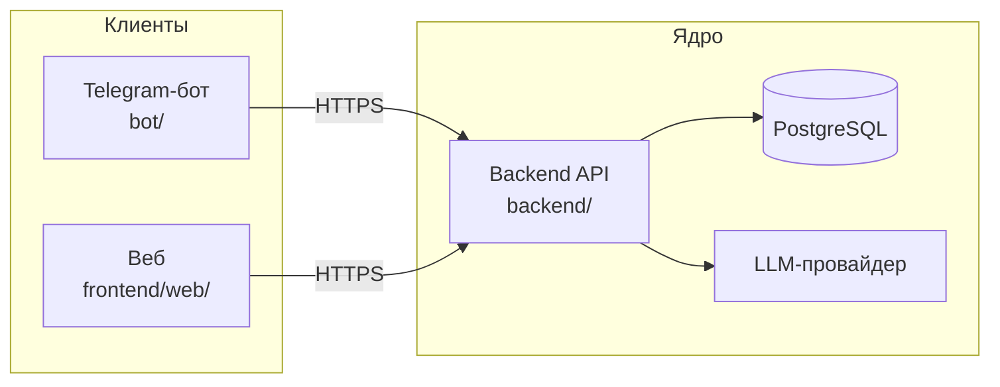
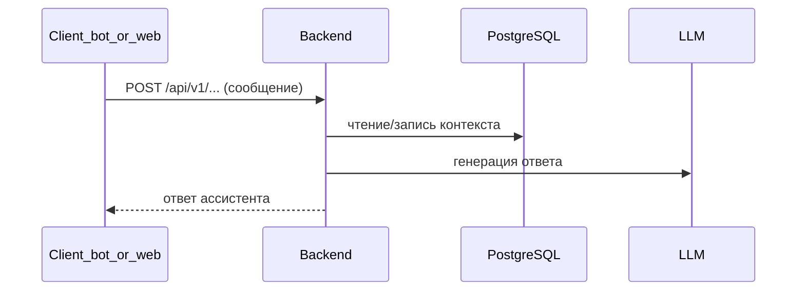

# Архитектура LLMStart (обзор)

Краткая схема репозитория: где живёт логика, как связаны части. Продуктовые границы и роли — в [vision.md](vision.md).

## Принцип

**Ядро — `backend/`**: HTTP API, домен, БД, вызовы LLM. **`bot/`** и **`frontend/web/`** — тонкие клиенты: только HTTP к `/api/v1`, без дублирования бизнес-правил.

## Компоненты

| Компонент | Каталог | Роль |
|-----------|---------|------|
| Backend | `backend/` | FastAPI, Alembic, async SQLAlchemy, интеграция с LLM |
| Telegram-бот | `bot/` | aiogram, вызовы backend |
| Веб-клиент | `frontend/web/` | Next.js (App Router), BFF-прокси к backend через `BACKEND_ORIGIN` |
| Данные | PostgreSQL | Пользователи, когорты, диалоги, прогресс (см. [data-model.md](data-model.md)) |
| LLM | внешний сервис | Вызывается только из backend (например OpenRouter) |

## Высокоуровневая схема

## Поток запроса (диалог)

## Детали и контракты

- [vision.md](vision.md) — границы системы, клиенты vs ядро
- [data-model.md](data-model.md) — сущности и связи
- [tech/api-contracts.md](tech/api-contracts.md) — обзор HTTP v1
- [api/openapi-v1.yaml](api/openapi-v1.yaml) и живой **`/openapi.json`** на запущенном backend
- [integrations.md](integrations.md) — секреты, окружение, провайдеры
- [adr/](adr/) — зафиксированные архитектурные решения (в т.ч. БД)

## Связанные документы для разработки

- [onboarding.md](onboarding.md) — поднять окружение и проверить стек
- [tech/db-tooling-guide.md](tech/db-tooling-guide.md) — Docker, миграции, смешанный Windows/WSL
