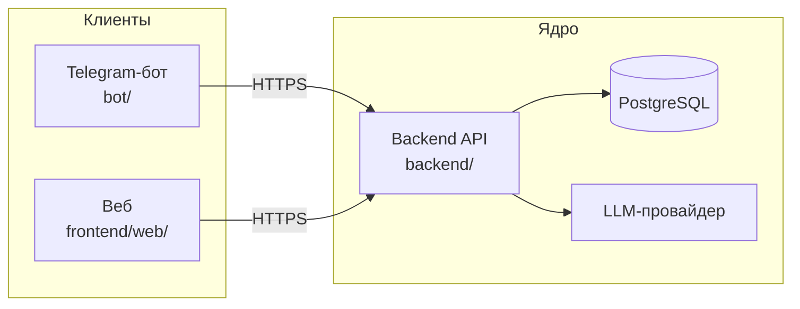
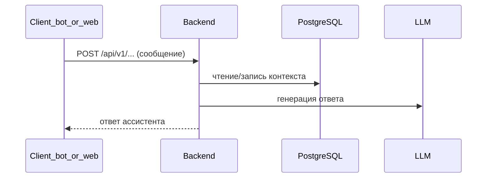

# Архитектура LLMStart (обзор)

Краткая схема репозитория: где живёт логика, как связаны части. Продуктовые границы и роли — в [vision.md](vision.md).

## Принцип

**Ядро — `backend/`**: HTTP API, домен, БД, вызовы LLM. **`bot/`** и **`frontend/web/`** — тонкие клиенты: только HTTP к `/api/v1`, без дублирования бизнес-правил.

## Компоненты

| Компонент | Каталог | Роль |
|-----------|---------|------|
| Backend | `backend/` | FastAPI, Alembic, async SQLAlchemy, интеграция с LLM |
| Telegram-бот | `bot/` | aiogram, вызовы backend |
| Веб-клиент | `frontend/web/` | Next.js (App Router), BFF-прокси к backend через `BACKEND_ORIGIN` |
| Данные | PostgreSQL | Пользователи, когорты, диалоги, прогресс (см. [data-model.md](data-model.md)) |
| LLM | внешний сервис | Вызывается только из backend (например OpenRouter) |

## Высокоуровневая схема

## Поток запроса (диалог)

## Локальный Docker

- Один манифест — корневой [`docker-compose.yml`](../docker-compose.yml): **postgres** всегда в проекте; **backend**, **web**, **bot** включены профилем **`app`** (полный стек).
- Образы и init SQL — каталог [`devops/`](../devops/README.md); сборка `docker build -f devops/<сервис>/Dockerfile .` из корня репозитория.
- Внутри compose клиенты ходят в backend по DNS-имени сервиса (`web` → `http://backend:8000`, бот — `BACKEND_HOST=backend`). Подробности и проверки — [tech/docker-compose-local.md](tech/docker-compose-local.md).

## Production (обзор)

Прод-развёртывание целится в **один внешний хост** (VPS) с публичным IP: **Timeweb Cloud** и CLI **`twc`**, SSH по ключу, далее тот же стек контейнеров, что в [docker-compose.ghcr.yml](../docker-compose.ghcr.yml) (см. [tech/docker-compose-ghcr.md](tech/docker-compose-ghcr.md)). Создание инстанса, ключи и токены — вне репозитория; идентификация и сценарий без секретов — [tech/timeweb-vps.md](tech/timeweb-vps.md). **Ручной** деплой на сервер: [копирование репозитория на VPS](tech/vps-manual-ghcr-deploy.md#2-копирование-репозитория-на-vps) (`git clone`), bootstrap Docker, `.env` по образцам, **`docker login ghcr.io` только вручную** при приватных пакетах, `docker compose` — [tech/vps-manual-ghcr-deploy.md](tech/vps-manual-ghcr-deploy.md). Клиенты (Telegram, браузер) обращаются к backend по **HTTPS** на публичный хост/домен после настройки сети и (при необходимости) reverse proxy — далее [tasklist-devops, итерация 5](tasks/tasklist-devops.md#iteration-5-cd-gha) (CD).

## Детали и контракты

- [vision.md](vision.md) — границы системы, клиенты vs ядро
- [data-model.md](data-model.md) — сущности и связи
- [tech/api-contracts.md](tech/api-contracts.md) — обзор HTTP v1
- [api/openapi-v1.yaml](api/openapi-v1.yaml) и живой **`/openapi.json`** на запущенном backend
- [integrations.md](integrations.md) — секреты, окружение, провайдеры
- [adr/](adr/) — зафиксированные архитектурные решения (в т.ч. БД)

## Связанные документы для разработки

- [onboarding.md](onboarding.md) — поднять окружение и проверить стек
- [tech/db-tooling-guide.md](tech/db-tooling-guide.md) — Docker, миграции, смешанный Windows/WSL
