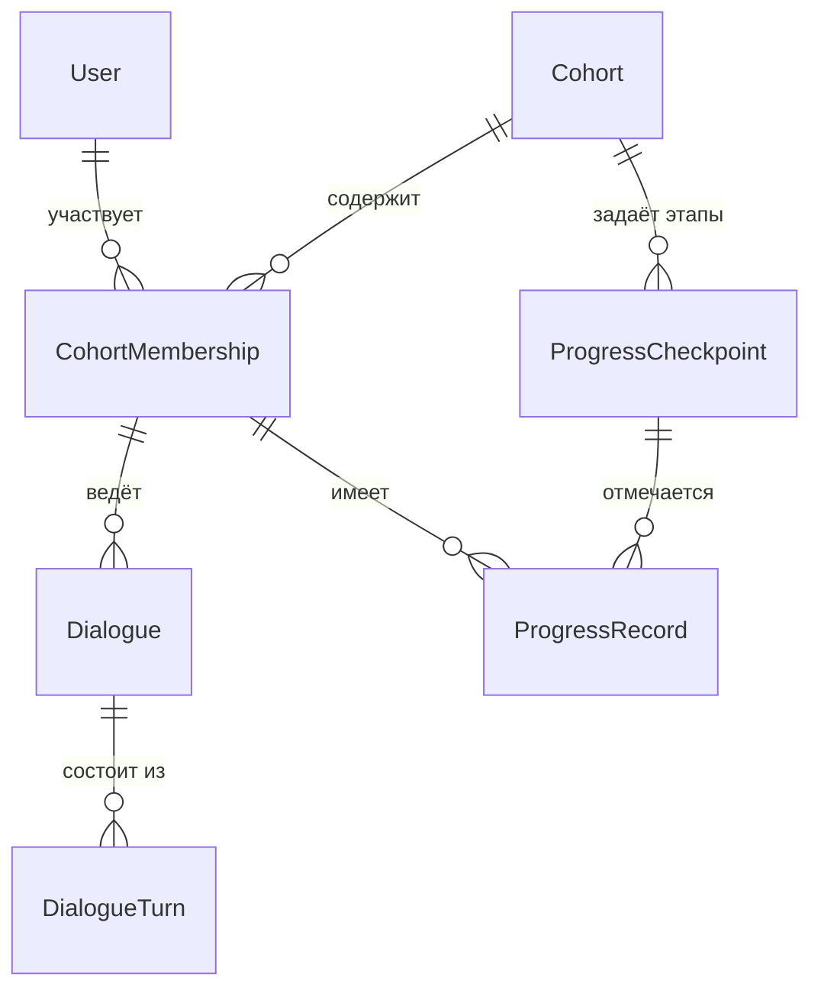
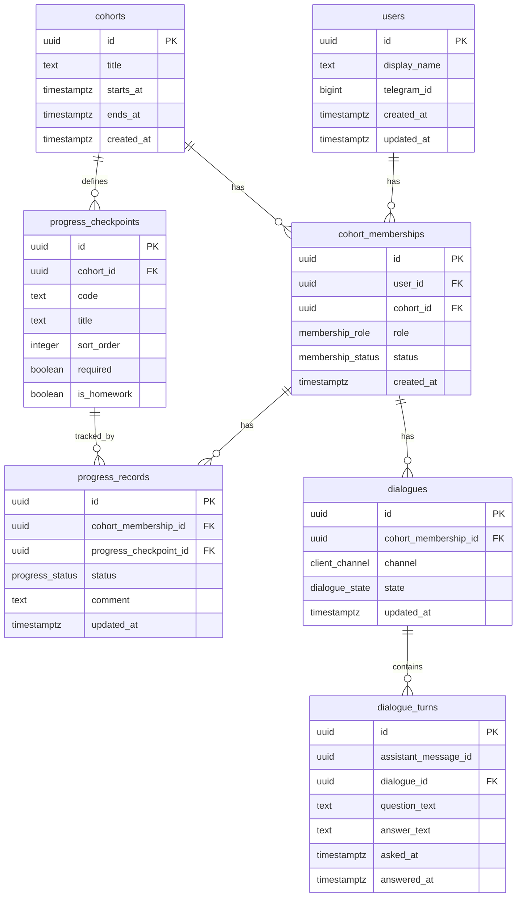

# Модель данных

Модель согласована с [`idea.md`](idea.md), [`vision.md`](vision.md) и [`docs/tech/user-scenarios.md`](tech/user-scenarios.md): **поток**, **студенты (и преподаватели)**, **диалоги с ассистентом**, **фиксация прогресса**. Публичный HTTP-контракт — [`docs/api/openapi-v1.yaml`](api/openapi-v1.yaml). Без лишней нормализации курса на первом шаге.

---

## Допущения учебного этапа

См. также таблицу в [`user-scenarios.md`](tech/user-scenarios.md).

| Допущение | Отражение в модели |
|-----------|-------------------|
| **Модуль == урок** | Один уровень программы потока — сущность **этап прогресса** (`ProgressCheckpoint`): в продукте это и «урок», и «модуль», и отдельное ДЗ, если так заведено в потоке. Отдельных сущностей «модуль» и «урок» нет. |
| **История для аналитики == пара «вопрос + ответ»** | Минимальная единица переписки в хранилище — **ход диалога** (`DialogueTurn`): одна строка БД = один вопрос пользователя и соответствующий ответ ассистента. |
| **Гостевой ассистент** | Вне потока / без участия — вне этой модели и сценариев потока. |

---

## Сопоставление: домен, API и таблицы PostgreSQL

Имена таблиц — **множественное число, snake_case** (согласовано с skill `postgresql-table-design` и будущими миграциями). Термин **Cohort** в API и документации соответствует таблице `cohorts` (не `flows` / `enrollments`: это снимает расхождение с OpenAPI и текущими путями `/api/v1/cohorts/...`).

| Домен (логика) | Ресурс / схема API | Таблица БД |
|----------------|-------------------|------------|
| `User` | `user_id` в ответах | `users` |
| `Cohort` | `cohort_id` | `cohorts` |
| `CohortMembership` | `membership_id` | `cohort_memberships` |
| `Dialogue` | `dialogue_id` | `dialogues` |
| `DialogueTurn` (ход, пара Q&A) | логически два сообщения в ответе `PostDialogueMessage` | `dialogue_turns` |
| `ProgressCheckpoint` | `checkpoint_id`, список чекпоинтов | `progress_checkpoints` |
| `ProgressRecord` | `PUT .../progress-records/{checkpoint_id}` | `progress_records` |

Таблица **`progress_checkpoints`**, а не `lessons`: имя совпадает с доменным термином и с OpenAPI, при этом в текстах продукт «урок программы потока» = строка в `progress_checkpoints`. Сид [`data/progress-import.v1.json`](../data/progress-import.v1.json) маппит `lesson_position` → колонку порядка (`sort_order`) чекпоинта.

---

## Основные сущности (логическая модель)

### Пользователь (`User`)

Учётка в системе: вход с веба, привязка Telegram и т.д.

| Поле (понятие) | Назначение | Типы (ориентир) |
|----------------|------------|-----------------|
| идентификатор | суррогатный ключ | UUID |
| имя | отображаемое имя в интерфейсе | строка, nullable |
| Telegram user id | импорт и матчинг бота | целое 64-bit, nullable, уникально среди ненулевых |
| прочие внешние идентификаторы | email/login — по мере необходимости | строка, nullable |
| роль по умолчанию | глобальная подсказка (опционально) | перечисление |
| служебные метки | создан, обновлён | `timestamptz` |

*Роль «студент / преподаватель» в контуре потока задаётся в **участии в потоке**.*

---

### Учебный поток (`Cohort`)

Один запуск группы по курсу: границы по времени, название.

| Поле (понятие) | Назначение | Типы (ориентир) |
|----------------|------------|-----------------|
| идентификатор | ключ потока | UUID |
| название | отображение и фильтры | строка |
| период | старт, окончание (если нужны) | `date` / `timestamptz`, nullable |

*Программа курса на учебном этапе не нормализуется отдельной сущностью «курс».*

---

### Участие в потоке (`CohortMembership`)

Связь **пользователь ↔ поток** с ролью в этом потоке.

| Поле (понятие) | Назначение | Типы (ориентир) |
|----------------|------------|-----------------|
| идентификатор | ключ записи | UUID |
| пользователь | ссылка на `User` | UUID (FK) |
| поток | ссылка на `Cohort` | UUID (FK) |
| роль | студент / преподаватель | перечисление (как в OpenAPI: `student`, `teacher`) |
| статус участия | активен, отчислён и т.д. | перечисление |

*Уникальность: одна строка на пару (пользователь, поток).*

---

### Диалог (`Dialogue`)

Сессия общения с ассистентом в рамках участия; разделяет каналы (бот / веб).

| Поле (понятие) | Назначение | Типы (ориентир) |
|----------------|------------|-----------------|
| идентификатор | ключ диалога | UUID |
| участие | ссылка на `CohortMembership` | UUID (FK) |
| канал клиента | telegram / web | перечисление |
| состояние | активен, архив | перечисление |
| обновлён | последняя активность | `timestamptz` |

*Политика продукта: не более одного **активного** диалога на пару (участие, канал) — см. частичный уникальный индекс в физической схеме.*

---

### Ход диалога (`DialogueTurn`)

Одна **пара** «вопрос пользователя + ответ ассистента» внутри `Dialogue`. Для аналитики преподавателя считается одной единицей активности (время события — момент вопроса).

| Поле (понятие) | Назначение | Типы (ориентир) |
|----------------|------------|-----------------|
| идентификатор хода | ключ строки; может отдаваться клиенту как идентификатор «сообщения пользователя» в API | UUID |
| идентификатор ответа | второй UUID для контракта «сообщение ассистента» (`assistant_message.id`) | UUID |
| диалог | ссылка на `Dialogue` | UUID (FK) |
| текст вопроса | содержимое | text |
| текст ответа | содержимое | text |
| задан вопрос | порядок и фильтр по периоду для отчётов | `timestamptz` |
| получен ответ | когда зафиксирован ответ | `timestamptz` |

*Связь «вопрос ↔ урок потока» на учебном этапе не обязательна; сценарии статистики по урокам — расширение.*

---

### Этап прогресса (`ProgressCheckpoint`)

**Урок программы потока** в смысле допущения «модуль == урок»: то, что студент отмечает в UI (в т.ч. ДЗ как отдельный этап, если заведён в потоке).

| Поле (понятие) | Назначение | Типы (ориентир) |
|----------------|------------|-----------------|
| идентификатор | ключ этапа | UUID |
| поток | ссылка на `Cohort` | UUID (FK) |
| код / заголовок | машиночитаемый код и имя | строка |
| порядок | сортировка в UI | целое |
| обязательность | опционально | boolean |
| **признак ДЗ** | участие этапа в лидерборде по домашкам | boolean |

*Поле «признак ДЗ» в OpenAPI v1 в `ProgressCheckpointItem` пока не отражено — при появлении в API добавить поле в схему ответа; в БД колонка нужна для запросов лидерборда.*

---

### Фиксация прогресса (`ProgressRecord`)

Отметка **по участию** и **этапу**.

| Поле (понятие) | Назначение | Типы (ориентир) |
|----------------|------------|-----------------|
| идентификатор | ключ записи | UUID |
| участие | ссылка на `CohortMembership` | UUID (FK) |
| этап | ссылка на `ProgressCheckpoint` | UUID (FK) |
| статус | см. API | перечисление |
| обновлено | когда изменилась отметка | `timestamptz` |
| комментарий | краткая заметка | строка, nullable |

*Уникальность: одна актуальная запись на пару (участие, этап).*

**Значения статуса в HTTP API v1** (JSON, snake_case): `not_started`, `in_progress`, `completed`, `skipped` — [`openapi-v1.yaml`](api/openapi-v1.yaml).

---

## Связи между сущностями

- **Пользователь** 1—N **Участие в потоке**; **Поток** 1—N **Участие в потоке**.
- **Участие в потоке** 1—N **Диалог**; **Диалог** 1—N **Ход диалога**.
- **Поток** 1—N **Этап прогресса**; **Участие в потоке** 1—N **Фиксация прогресса**; **Этап прогресса** 1—N **Фиксация прогресса**.

---

## Физическая схема (PostgreSQL)

### Перечисления

Для стабильности и совпадения с JSON API строковые значения фиксируются типами **PostgreSQL ENUM** (альтернатива — `text` + `CHECK`; для учебного этапа выбран ENUM).

| Тип PG | Значения |
|--------|----------|
| `membership_role` | `student`, `teacher` |
| `membership_status` | `active`, `withdrawn` |
| `client_channel` | `telegram`, `web` |
| `dialogue_state` | `active`, `archived` |
| `progress_status` | `not_started`, `in_progress`, `completed`, `skipped` |

При добавлении значений — только через миграцию (новый `ALTER TYPE ... ADD VALUE`).

### Таблицы и колонки

**`users`**

| Колонка | Тип | Ограничения |
|---------|-----|-------------|
| `id` | `uuid` | PK, default `gen_random_uuid()` |
| `display_name` | `text` | nullable |
| `telegram_id` | `bigint` | nullable; уникальность среди ненулевых — частичный уникальный индекс |
| `created_at` | `timestamptz` | NOT NULL, default `now()` |
| `updated_at` | `timestamptz` | NOT NULL, default `now()` |

**`cohorts`**

| Колонка | Тип | Ограничения |
|---------|-----|-------------|
| `id` | `uuid` | PK |
| `title` | `text` | NOT NULL |
| `starts_at` | `timestamptz` | nullable |
| `ends_at` | `timestamptz` | nullable |
| `created_at` | `timestamptz` | NOT NULL, default `now()` |

**`cohort_memberships`**

| Колонка | Тип | Ограничения |
|---------|-----|-------------|
| `id` | `uuid` | PK |
| `user_id` | `uuid` | NOT NULL, FK → `users(id)` ON DELETE RESTRICT |
| `cohort_id` | `uuid` | NOT NULL, FK → `cohorts(id)` ON DELETE RESTRICT |
| `role` | `membership_role` | NOT NULL |
| `status` | `membership_status` | NOT NULL, default `active` |
| `created_at` | `timestamptz` | NOT NULL, default `now()` |

UNIQUE (`user_id`, `cohort_id`). Индекс (`cohort_id`) — выборки **всех участников потока** (`WHERE cohort_id = ?`); составной UNIQUE с лидирующим `user_id` такой фильтр не покрывает оптимально.

**`progress_checkpoints`**

| Колонка | Тип | Ограничения |
|---------|-----|-------------|
| `id` | `uuid` | PK |
| `cohort_id` | `uuid` | NOT NULL, FK → `cohorts(id)` ON DELETE RESTRICT |
| `code` | `text` | NOT NULL |
| `title` | `text` | NOT NULL |
| `sort_order` | `integer` | NOT NULL |
| `required` | `boolean` | NOT NULL, default true |
| `is_homework` | `boolean` | NOT NULL, default false |

UNIQUE (`cohort_id`, `code`). Индекс (`cohort_id`, `sort_order`).

**`progress_records`**

| Колонка | Тип | Ограничения |
|---------|-----|-------------|
| `id` | `uuid` | PK |
| `cohort_membership_id` | `uuid` | NOT NULL, FK → `cohort_memberships(id)` ON DELETE RESTRICT |
| `progress_checkpoint_id` | `uuid` | NOT NULL, FK → `progress_checkpoints(id)` ON DELETE RESTRICT |
| `status` | `progress_status` | NOT NULL |
| `comment` | `text` | nullable |
| `updated_at` | `timestamptz` | NOT NULL, default `now()` |

UNIQUE (`cohort_membership_id`, `progress_checkpoint_id`). Индекс `progress_checkpoint_id` (сводки по группе).

**`dialogues`**

| Колонка | Тип | Ограничения |
|---------|-----|-------------|
| `id` | `uuid` | PK |
| `cohort_membership_id` | `uuid` | NOT NULL, FK → `cohort_memberships(id)` ON DELETE RESTRICT |
| `channel` | `client_channel` | NOT NULL |
| `state` | `dialogue_state` | NOT NULL, default `active` |
| `updated_at` | `timestamptz` | NOT NULL, default `now()` |

Индекс (`cohort_membership_id`). Частичный UNIQUE: (`cohort_membership_id`, `channel`) WHERE `state = 'active'`.

**`dialogue_turns`**

| Колонка | Тип | Ограничения |
|---------|-----|-------------|
| `id` | `uuid` | PK; в API — `user_message_id` |
| `assistant_message_id` | `uuid` | NOT NULL, UNIQUE; в API — `assistant_message.id` |
| `dialogue_id` | `uuid` | NOT NULL, FK → `dialogues(id)` ON DELETE CASCADE |
| `question_text` | `text` | NOT NULL |
| `answer_text` | `text` | NOT NULL |
| `asked_at` | `timestamptz` | NOT NULL |
| `answered_at` | `timestamptz` | NOT NULL |

CHECK (`answered_at >= asked_at`) — по желанию, фиксирует согласованность времени пары (ошибка приложения не оставит «ответ раньше вопроса»).

Индекс (`dialogue_id`, `asked_at`) — история диалога и фильтр по периоду. Индекс (`asked_at`) опционален для тяжёлых отчётов по потоку (тогда запрос идёт через join на `dialogues` → `cohort_membership` → фильтр `cohort_id`); при росте данных рассмотреть составной индекс через денормализацию или materialized view — вне учебного этапа.

### Внешние ключи: политика удаления

- `RESTRICT` на связях домена пользователь / поток / участие / чекпоинт / запись прогресса — случайное удаление родителя не ломает целостность без явного решения.
- `CASCADE` с `dialogues` на `dialogue_turns` — при удалении диалога удаляются ходы.

### Результат ревью (postgresql-table-design)

Проверка по skill [`.cursor/skills/postgresql-table-design/SKILL.md`](../.cursor/skills/postgresql-table-design/SKILL.md) и ориентирам ADR-001.

| Критерий | Статус | Комментарий |
|----------|--------|-------------|
| Суррогатные ключи UUID | OK | Все PK — `uuid`; авто-генерация в примере для `users.id` через `gen_random_uuid()` — в миграции включить расширение `pgcrypto` (или задавать UUID в приложении единообразно для всех таблиц). |
| Имена таблиц, `id` | OK | Множественное число, snake_case, PK `id`. |
| FK с `ON DELETE` | OK | Доменные связи — `RESTRICT`; ходы диалога — `CASCADE` с `dialogues`. |
| Время | OK | События — `timestamptz`. |
| Тексты / сообщения | OK | Имена, вопросы, ответы — `text`. |
| Перечисления | OK | ENUM в PG согласован с OpenAPI (`snake_case` для `progress_status`). Смена набора значений ENUM в Alembic/SQLAlchemy — планировать отдельными шагами миграции. |
| UNIQUE по бизнес-парам | OK | Участие (пользователь, поток); прогресс (участие, чекпоинт); частичный UNIQUE активного диалога; уникальный `assistant_message_id`. |
| Индексы под фильтры | OK (уточнено) | Явно добавлен индекс `cohort_memberships(cohort_id)` под сценарий «участники потока». Остальное: FK/списки чекпоинтов, ходы по диалогу и `asked_at`, частичный UNIQUE. |
| Денормализация | OK | Лишнего дублирования нет. |
| JSONB | OK | Не используется на базовом этапе; допустимо позже точечно по skill. |
| Миграции | OK | Только Alembic; путь к ревизиям — по соглашению репозитория (`backend/migrations/`, см. правила проекта). |

**Рекомендации (не блокируют учебную схему):** опциональный CHECK `answered_at >= asked_at` на `dialogue_turns`; при росте отчётов по потоку — пересмотреть индексы под конкретные `EXPLAIN` запросов активности.

---

## Физическая ER-диаграмма (Mermaid)

Сущности соответствуют таблицам; в скобках — PK/FK.

---

## Соответствие реализации backend (на момент задачи 05)

- **Ходы диалога:** ORM-класс `DialogueTurn` → таблица `dialogue_turns`; миграция Alembic `0004_dialogue_turns` переносит данные из `dialogue_messages`, если та присутствовала (старые БД). Свежий `make db-reset` получает `dialogue_turns` уже из `Base.metadata.create_all` на шаге `0001_initial`.
- **Перечисления:** в коде `SAEnum(..., native_enum=False)` — в PostgreSQL значения хранятся как строки (VARCHAR), а не как отдельные типы `ENUM` из раздела «Перечисления» выше; это сознательное упрощение до отдельной миграции под нативные ENUM.
- **Колонки FK:** в ORM для `progress_records` используются имена `membership_id` и `checkpoint_id` (не `cohort_membership_id` / `progress_checkpoint_id` из ER-текста) — семантика та же.
- **Пользователь:** в БД и ORM колонка отображаемого имени — `name`; импорт Telegram в сиде пишет в `telegram_user_id` (строка), что расходится с `bigint telegram_id` в целевой ER — см. также ADR и последующие выравнивающие миграции при необходимости.
- **Доступ к данным:** репозитории в `backend/app/infrastructure/repositories/`, сценарии HTTP — в `backend/app/services/`.

---

## Выбор СУБД

Полное обоснование, альтернативы и последствия — в **[ADR-001](adr/adr-001-database.md)**. Ниже — краткое резюме для модели данных.

### MVP

**PostgreSQL** — один инстанс на сервис или общий для первого backend.

- Реляционная модель (потоки, участия, FK, уникальные ограничения) без обходных путей.
- При необходимости **JSONB** для редких гибких полей без немедленной жёсткой схемы.
- Зрелая экосистема, миграции, бэкапы, хостинг (managed Postgres).

### Дальнейшее развитие

Оставаться на **PostgreSQL** как основной OLTP-хранилище для домена сопровождения потока.

- Несколько сервисов могут использовать **отдельные схемы** или БД с явными границами; при необходимости — **read replicas**, позже — вынос аналитики/поиска в отдельные хранилища без смены логической модели на уровне продуктовых сущностей.
- Расширения (полнотекст, очереди через внешние брокеры) не привязывают продукт к нишевой СУБД.

**Альтернативы (кратко):** SQLite удобен для прототипа одного процесса, но слабее для нескольких сервисов и конкурентной записи; MySQL/MariaDB возможны, но единый выбор Postgres упрощает типы (JSONB, UUID) и документацию для команды.
