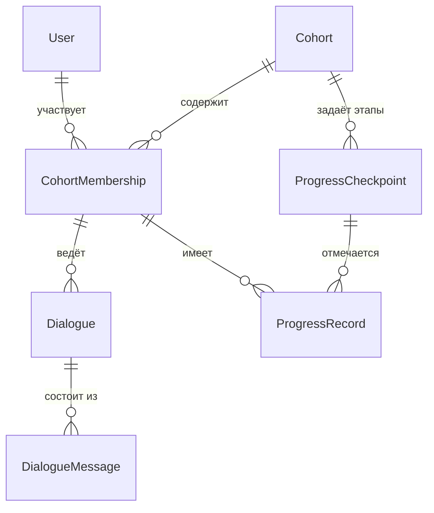

# Модель данных

Модель согласована с [`idea.md`](idea.md) и [`vision.md`](vision.md): **поток**, **студенты (и преподаватели)**, **диалоги с ассистентом**, **фиксация прогресса**. Без лишней нормализации курса на первом шаге.

---

## Основные сущности

### Пользователь (`User`)

Учётка в системе: вход с веба, привязка Telegram и т.д.

| Поле (понятие) | Назначение | Типы (ориентир) |
|----------------|------------|-----------------|
| идентификатор | суррогатный ключ | UUID |
| внешние идентификаторы | Telegram user id, email/login — что используется | строка / nullable поля |
| роль по умолчанию | глобальная подсказка (опционально) | перечисление |
| служебные метки | создан, обновлён | timestamp |

*Роль «студент / преподаватель» в контуре потока задаётся в **участии в потоке**, а не обязательно только здесь.*

---

### Учебный поток (`Cohort`)

Один запуск группы по курсу: границы по времени, название, привязка к программе курса.

| Поле (понятие) | Назначение | Типы (ориентир) |
|----------------|------------|-----------------|
| идентификатор | ключ потока | UUID |
| название / код | отображение и фильтры | строка |
| период | старт, окончание (если нужны) | date / timestamp, nullable |
| ссылка на программу | внешний ключ или код курса, если программа вынесена позже | UUID / строка, nullable |

*Для MVP программа может быть зашита в конфиг или храниться как код/версия без отдельной сущности «курс».*

---

### Участие в потоке (`CohortMembership`)

Связь **пользователь ↔ поток** с ролью в этом потоке.

| Поле (понятие) | Назначение | Типы (ориентир) |
|----------------|------------|-----------------|
| идентификатор | ключ записи | UUID |
| пользователь | ссылка на `User` | UUID (FK) |
| поток | ссылка на `Cohort` | UUID (FK) |
| роль | студент / преподаватель (и др. при расширении) | перечисление |
| статус участия | активен, отчислён и т.д. | перечисление |

*Ограничение уникальности: один пользователь — одно участие в данном потоке (с одной ролью или по правилам продукта).*

---

### Диалог (`Dialogue`)

Сессия общения с ассистентом в рамках потока и пользователя; разделяет каналы (бот / веб).

| Поле (понятие) | Назначение | Типы (ориентир) |
|----------------|------------|-----------------|
| идентификатор | ключ диалога | UUID |
| участие | ссылка на `CohortMembership` | UUID (FK) |
| канал клиента | telegram / web | перечисление |
| состояние | активен, архив (по политике) | перечисление |
| обновлён | последняя активность | timestamp |

*При необходимости несколько диалогов на одного участника (например, по темам) — допускается; для MVP часто один активный диалог на пару (участие, канал).*

---

### Сообщение диалога (`DialogueMessage`)

Одна реплика в истории чата для LLM.

| Поле (понятие) | Назначение | Типы (ориентир) |
|----------------|------------|-----------------|
| идентификатор | ключ сообщения | UUID |
| диалог | ссылка на `Dialogue` | UUID (FK) |
| роль в переписке | пользователь / ассистент / система | перечисление |
| текст | содержимое (политика хранения — отдельно) | text |
| создано | порядок и аудит | timestamp |

---

### Этап прогресса (`ProgressCheckpoint`)

То, что студент может **отметить** в рамках потока: неделя, модуль, ДЗ — без детальной модели «занятий».

| Поле (понятие) | Назначение | Типы (ориентир) |
|----------------|------------|-----------------|
| идентификатор | ключ этапа | UUID |
| поток | ссылка на `Cohort` | UUID (FK) |
| код / заголовок | машиночитаемый код и человекочитаемое имя | строка |
| порядок | сортировка в UI | целое |
| обязательность | опционально | boolean |

---

### Фиксация прогресса (`ProgressRecord`)

Отметка **по участнику** и **этапу**: выполнено / в работе / пропущено и т.д.

| Поле (понятие) | Назначение | Типы (ориентир) |
|----------------|------------|-----------------|
| идентификатор | ключ записи | UUID |
| участие | ссылка на `CohortMembership` (студент) | UUID (FK) |
| этап | ссылка на `ProgressCheckpoint` | UUID (FK) |
| статус | согласованный набор состояний | перечисление |
| обновлено | когда изменилась отметка | timestamp |
| комментарий | краткая заметка (опционально) | строка, nullable |

*Уникальность: одна актуальная запись на пару (участие, этап) или версионирование — решается при внедрении.*

---

## Связи между сущностями

- **Пользователь** 1—N **Участие в потоке**; **Поток** 1—N **Участие в потоке**.
- **Участие в потоке** 1—N **Диалог**; **Диалог** 1—N **Сообщение диалога**.
- **Поток** 1—N **Этап прогресса**; **Участие в потоке** 1—N **Фиксация прогресса**; **Этап прогресса** 1—N **Фиксация прогресса**.

---

## Выбор СУБД

Полное обоснование, альтернативы и последствия — в **[ADR-001](adr/adr-001-database.md)**. Ниже — краткое резюме для модели данных.

### MVP

**PostgreSQL** — один инстанс на сервис или общий для первого backend.

- Реляционная модель (потоки, участия, FK, уникальные ограничения) без обходных путей.
- При необходимости **JSONB** для редких гибких полей без немедленной жёсткой схемы.
- Зрелая экосистема, миграции, бэкапы, хостинг (managed Postgres).

### Дальнейшее развитие

Оставаться на **PostgreSQL** как основной OLTP-хранилище для домена сопровождения потока.

- Несколько сервисов могут использовать **отдельные схемы** или БД с явными границами; при необходимости — **read replicas**, позже — вынос аналитики/поиска в отдельные хранилища без смены логической модели на уровне продуктовых сущностей.
- Расширения (полнотекст, очереди через внешние брокеры) не привязывают продукт к нишевой СУБД.

**Альтернативы (кратко):** SQLite удобен для прототипа одного процесса, но слабее для нескольких сервисов и конкурентной записи; MySQL/MariaDB возможны, но единый выбор Postgres упрощает типы (JSONB, UUID) и документацию для команды.
