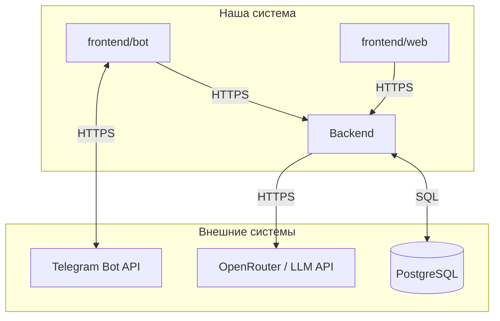

# Внешние интеграции

Согласовано с [`vision.md`](vision.md), [`data-model.md`](data-model.md) и [`adr/adr-001-database.md`](adr/adr-001-database.md). Здесь — **внешние** сервисы и каналы; обмен **frontend ↔ backend** внутренний и не перечисляется.

---

## Внешние системы

| Система | Назначение в продукте | Направление | Протокол / способ | Критичность |
|---------|------------------------|-------------|-------------------|-------------|
| [**Telegram Bot API**](https://core.telegram.org/bots/api) | Доставка сообщений и команд боту; ответы пользователю в Telegram | **bidirectional**: входящие апдейты от Telegram → клиент бота; исходящие запросы клиента → Telegram (sendMessage и др.) | HTTPS (long polling / webhook к backend или к процессу бота — по схеме развёртывания) | **MVP** |
| [**OpenRouter**](https://openrouter.ai/) (или иной провайдер с OpenAI-совместимым API) | Генерация ответов ассистента по курсу; вызовы **только из backend** | **out**: backend → провайдер | HTTPS, REST, схема совместимая с OpenAI Chat Completions | **MVP** |
| **PostgreSQL** (часто в виде [managed-инстанса](https://www.postgresql.org/) у облачного провайдера) | Персистентность пользователей, потоков, диалогов, прогресса (см. [`data-model.md`](data-model.md)) | **bidirectional**: backend ↔ СУБД | SQL, TCP/TLS (драйвер приложения) | **MVP** |
| **Провайдер хостинга** (VPS / PaaS / Kubernetes) | Размещение backend, БД, при необходимости — бота и статики web | **out**: деплой и эксплуатация; мониторинг от провайдера | SSH, API облака, CI/CD | **MVP** |

*Клиенты **не** обращаются к LLM и БД напрямую — только через backend ([`vision.md`](vision.md)).*

---

## Зависимости и риски

- **Критичны для MVP:** **Telegram Bot API** (без него нет канала бота), **LLM-провайдер** (нет смысла ассистента без ответов модели), **PostgreSQL** (персистентность домена). Отказ любого из трёх блокирует соответствующий сценарий; нужны **понятные сообщения пользователю**, **retry** и **логирование** без утечки текста переписки.
- **Квоты и ключи:** LLM и Telegram требуют **секретов** и лимитов; рост потока → мониторинг расхода и ошибок API.
- **Сетевой периметр:** все внешние вызовы — **TLS**; секреты только из окружения/хранилища, не в репозитории.
- **Смена провайдера LLM:** при сохранении OpenAI-совместимого контракта **риск ниже**; вендор-лок на проприетарный API — отдельное решение.
- **Telegram:** политика платформы и доступность API в регионе — **внешние** риски; при необходимости — **web** как альтернативный канал (уже в roadmap продукта).
