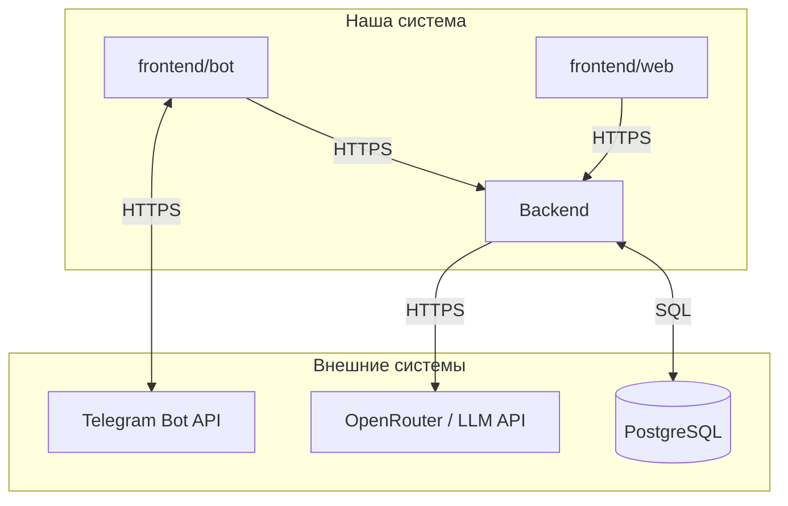

# Внешние интеграции

Согласовано с [`vision.md`](vision.md), [`data-model.md`](data-model.md) и [`adr/adr-001-database.md`](adr/adr-001-database.md). Здесь — **внешние** сервисы и каналы; обмен **frontend ↔ backend** внутренний и не перечисляется.

---

## Внешние системы

| Система | Назначение в продукте | Направление | Протокол / способ | Критичность |
|---------|------------------------|-------------|-------------------|-------------|
| [**Telegram Bot API**](https://core.telegram.org/bots/api) | Доставка сообщений и команд боту; ответы пользователю в Telegram | **bidirectional**: входящие апдейты от Telegram → клиент бота; исходящие запросы клиента → Telegram (sendMessage и др.) | HTTPS (long polling / webhook к backend или к процессу бота — по схеме развёртывания) | **MVP** |
| [**OpenRouter**](https://openrouter.ai/) (или иной провайдер с OpenAI-совместимым API) | Генерация ответов ассистента по курсу; вызовы **только из backend** | **out**: backend → провайдер | HTTPS, REST, схема совместимая с OpenAI Chat Completions | **MVP** |
| **PostgreSQL** (часто в виде [managed-инстанса](https://www.postgresql.org/) у облачного провайдера) | Персистентность пользователей, потоков, диалогов, прогресса (см. [`data-model.md`](data-model.md)) | **bidirectional**: backend ↔ СУБД | SQL, TCP/TLS (драйвер приложения) | **MVP** |
| **Провайдер хостинга** (VPS / PaaS / Kubernetes) | Размещение backend, БД, при необходимости — бота и статики web | **out**: деплой и эксплуатация; мониторинг от провайдера | SSH, API облака, CI/CD | **MVP** |

*Клиенты **не** обращаются к LLM и БД напрямую — только через backend ([`vision.md`](vision.md)).*

---

## Backend HTTP API (клиенты → ядро)

Публичный контракт для Telegram-бота и веб-клиента — **единый** HTTP API backend.

| Параметр | Значение |
|----------|----------|
| Базовый URL | Задаётся средой (например `http://127.0.0.1:8000` локально); в проде — HTTPS за reverse-proxy |
| Версия | Префикс пути **`/api/v1/`**; ломающие изменения — только в новой мажорной версии API |
| Черновик схем | [`docs/api/openapi-v1.yaml`](api/openapi-v1.yaml) — опора для контракта и согласования с FastAPI |
| Живая схема | На том же хосте, что и backend: **`GET /openapi.json`**, UI **`/docs`** (Swagger), **`/redoc`** (ReDoc) |
| Текстовая сводка контракта | [`docs/tech/api-contracts.md`](tech/api-contracts.md) |

Политика ошибок, идентификация на MVP и соответствие доменной модели — в [task-02-contracts/plan.md](tasks/impl/backend/iteration-2-backend-api/tasks/task-02-contracts/plan.md) и в [`docs/tech/api-contracts.md`](tech/api-contracts.md). Дублировать полный список полей здесь не требуется.

**Аутентификация клиентов:** в [`docs/api/openapi-v1.yaml`](api/openapi-v1.yaml) зафиксирована схема `bearerAuth`. Опционально `BACKEND_API_CLIENT_TOKEN` в `Settings`: если задан, для `/api/v1/*` требуется `Authorization: Bearer` с этим значением (см. [`backend/.env.example`](../backend/.env.example)).

**Секреты (только окружение, не репозиторий):** `TELEGRAM_TOKEN` и остальные переменные бота — **только** в корневом `.env` (читает `bot/config.py`). `OPENROUTER_API_KEY` и LLM — **только** в `backend/.env`. Опционально `BACKEND_API_CLIENT_TOKEN` задаётся в **обоих** местах с **одинаковым** значением (backend проверяет Bearer, бот его отправляет). Шаблоны: [`.env.example`](../.env.example) — бот; [`backend/.env.example`](../backend/.env.example) — backend.

---

## Backend и LLM

**Текущее состояние:** процесс `backend/` вызывает OpenRouter (или иной OpenAI-совместимый endpoint) из [`backend/app/infrastructure/llm_assistant.py`](../backend/app/infrastructure/llm_assistant.py), если задан `OPENROUTER_API_KEY`; иначе в тестах и на локалке без ключа используется заглушка ответа. Telegram-бот (`bot/`) — **тонкий клиент**: HTTP к `/api/v1/` (см. задача **07** в [tasklist-backend](tasks/tasklist-backend.md)); прямого вызова LLM из бота нет.

**Персистентность:** только **PostgreSQL** ([`adr/adr-001-database.md`](adr/adr-001-database.md)). В **`backend/.env`** задайте **`DATABASE_URL`** (async, `postgresql+asyncpg://...`) — см. [`backend/.env.example`](../backend/.env.example). Миграции Alembic: из корня репозитория `make migrate-backend` или `cd backend && uv run alembic upgrade head` (нужен dev extra с `psycopg2` для Alembic).

**Конфигурация LLM на стороне backend:** `OPENROUTER_API_KEY`, `OPENROUTER_BASE_URL`, `OPENROUTER_MODEL`, `OPENROUTER_TIMEOUT`, `SYSTEM_PROMPT_PATH`, опционально `PROXY_URL` — в `Settings` и в [`backend/.env.example`](../backend/.env.example).

**Поведение при сбоях и логи:** логировать тип ошибки, HTTP-код/latency провайдера, correlation/request id; **не** писать в лог тексты пользовательских сообщений и ответов модели ([`vision.md`](vision.md), раздел 15). Клиенту API — коды **502** (`LLM_BAD_GATEWAY`) и **503** (`LLM_UNAVAILABLE`) по контракту, без внутренних деталей провайдера.

---

## Зависимости и риски

- **Критичны для MVP:** **Telegram Bot API** (без него нет канала бота), **LLM-провайдер** (нет смысла ассистента без ответов модели), **PostgreSQL** (персистентность домена). Отказ любого из трёх блокирует соответствующий сценарий; нужны **понятные сообщения пользователю**, **retry** и **логирование** без утечки текста переписки.
- **Квоты и ключи:** LLM и Telegram требуют **секретов** и лимитов; рост потока → мониторинг расхода и ошибок API.
- **Сетевой периметр:** все внешние вызовы — **TLS**; секреты только из окружения/хранилища, не в репозитории.
- **Смена провайдера LLM:** при сохранении OpenAI-совместимого контракта **риск ниже**; вендор-лок на проприетарный API — отдельное решение.
- **Telegram:** политика платформы и доступность API в регионе — **внешние** риски; при необходимости — **web** как альтернативный канал (уже в roadmap продукта).
