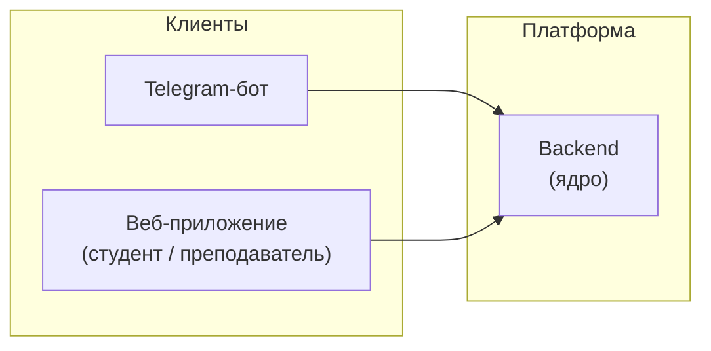
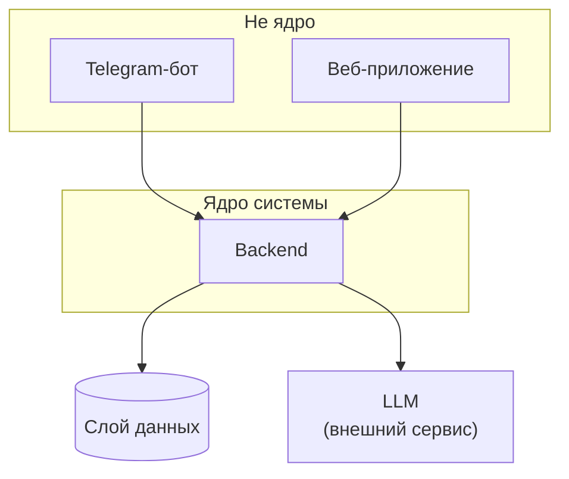
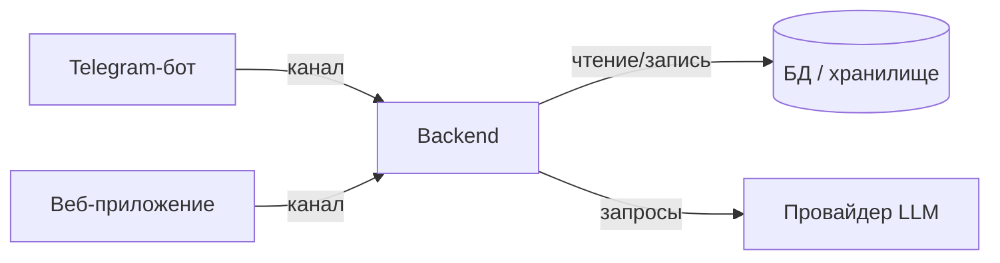
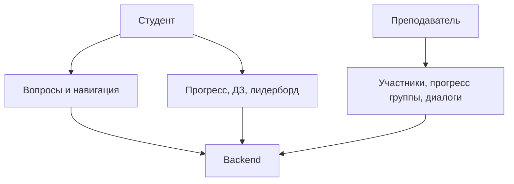
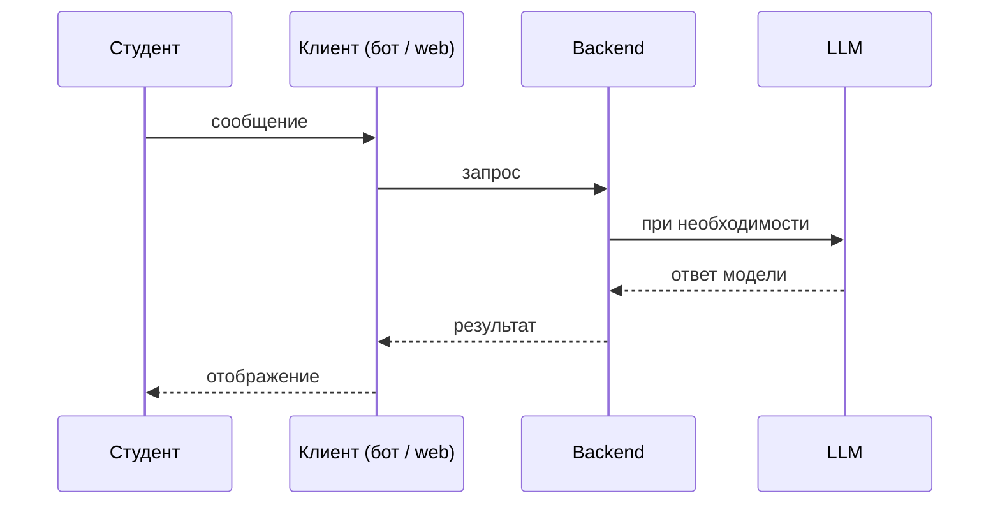
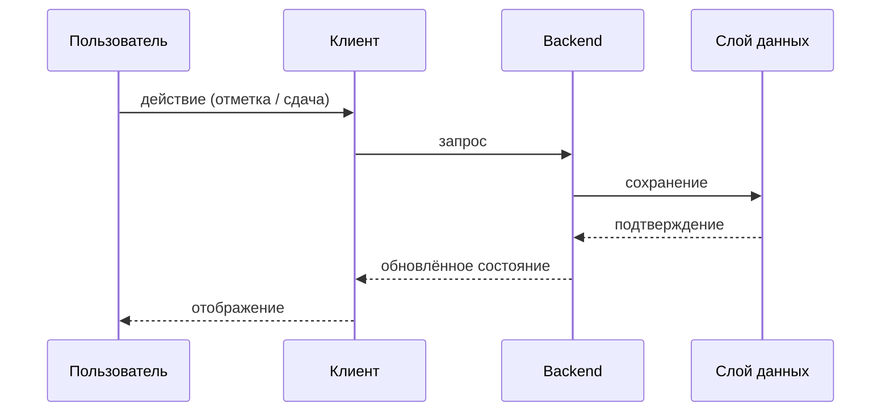

# Техническое видение системы

Система сопровождения учебного потока курса **AI-driven fullstack developer**. Продуктовая идея и границы ценности — в [`idea.md`](idea.md).

---

## 1. Границы системы

- Система **не сводится к Telegram-боту**: это **мультиклиентская платформа** сопровождения потока.
- **Telegram-бот** — **первый клиент**: быстрый вход для студента, сценарии «в дороге».
- **Веб-приложение** — **единый frontend-проект** с разграничением по ролям:
  - интерфейс **студента** (навигация, прогресс, фиксация результатов, контекст потока);
  - интерфейс **преподавателя** (обзор потока, активность группы, сопровождение).



---

## 2. Архитектурный принцип: ядро — backend

- **Бот не является ядром** и не содержит уникальной бизнес-логики сопровождения потока.
- **Ядро — единый серверный слой (backend)**.
- **Telegram-бот** и **веб-интерфейс** — **клиенты** этого слоя: адаптеры каналов и UX, а не дубли логики.
- В **backend** централизованы: сопровождение потока, работа с материалами и знаниями курса, **прогресс и результаты**, интеграция с **LLM**, доступ к данным по ролям.



---

## 3. Состав системы (high-level)

| Часть | Роль |
|--------|------|
| **Telegram-бот** | Клиент: сообщения, команды, сценарии фиксации в привычном канале. |
| **Веб-приложение** | Клиент: единый UI с ролями студента и преподавателя; те же возможности — в форме кабинета и обзоров. |
| **Backend** | Единая точка правил, данных, LLM и авторизации для всех клиентов. |
| **Слой данных** | Персистентность пользователей, потоков, прогресса, материалов и сдач; детали модели — не в этом документе. |
| **LLM-компонент** | Внешний сервис генерации и, при необходимости, извлечения по контенту курса; вызывается из backend. |



---

## 4. Роли и пользовательские сценарии

Детальное описание сценариев учебного этапа и требований к данным (без техники) — в [`tech/user-scenarios.md`](tech/user-scenarios.md). Ниже — сжатый перечень, согласованный с этим документом; сценарии **сквозные** (бот и веб — одни и те же смыслы).

**Роли**

| Роль | Назначение |
|------|------------|
| **Студент** | Участник потока: вопросы по курсу, навигация, **свой** прогресс, **лидерборд по выполнению ДЗ** среди потока (в границах политики видимости), фиксация результата. |
| **Преподаватель** | Обзор потока: **участники**, **прогресс группы** по этапам, **активность за период** по вопросам студентов к ассистенту и **агрегированная статистика** по диалогам; сопровождение без дублирования каналов вручную. |

**Допущения учебного этапа** (подробно в user-scenarios): **модуль == урок** (один уровень программы для прогресса); для аналитики диалогов минимальная единица — **пара «вопрос пользователя + ответ ассистента»**. Гостевые диалоги без потока не входят в аналитику группы.

**Сценарии (сквозные, не привязаны к одному клиенту)**

- навигация по программе и материалам;
- ответы на вопросы в границах курса (в т.ч. с опорой на LLM);
- понимание **статуса потока** (расписание, этапы, что дальше);
- **фиксация результата** (выполнение этапов, сдачи, отметки прогресса) — сначала естественно в боте, затем полноценно во веб-интерфейсе;
- у студента — **картина собственного прогресса** и **сравнение с группой** по выполнению домашних заданий (лидерборд на агрегатах);
- у преподавателя — **состав группы**, **сводка прогресса**, **активность и отчёты по диалогам** за выбранный период и опора для **сопровождения потока**.



---

## 5. Доменные сущности (уровень vision)

Ключевые понятия предметной области для единого языка в коде и документации. **Схемы хранения и связи** выносятся в отдельный документ.

**Перечень:** пользователь; участник потока; модуль; занятие; материал; домашнее задание; результат / submission; статус прогресса; FAQ / knowledge item.

Детализация: [`data-model.md`](data-model.md).

---

## 6. Архитектурные решения

Значимые платформенные решения фиксируются как **ADR** в каталоге [`adr/`](adr/README.md) и дополняют этот документ: контекст, альтернативы и последствия — в самих ADR, здесь — только указатель.

| ADR | Суть | Документ |
|-----|------|----------|
| ADR-001 | Основная СУБД проекта — **PostgreSQL** | [`adr/adr-001-database.md`](adr/adr-001-database.md) |

Принципы ведения списка ADR — в [`adr/README.md`](adr/README.md).

---

## 7. Внешние связи (уровень vision)

К системе относятся, помимо клиентов:

- **Провайдер LLM** (и при необходимости связанные API ключи и лимиты);
- **Telegram Bot API** как транспорт клиента «бот»;
- инфраструктура развёртывания (хостинг backend, **frontend** — bot и web, секреты).

Перечень интеграций и ответственности — [`integrations.md`](integrations.md).

---

## 8. Структура репозитория (мультикомпонентный проект)

Целевая раскладка репозитория (каталоги и типовые файлы; точный набор уточняется при внедрении):

```text
llmstart-fullstack-live/
├── .env.example
├── .gitignore
├── Makefile
├── pyproject.toml              # workspace / общие задачи (Python: bot и backend)
├── README.md
├── uv.lock                     # при использовании uv
├── frontend/
│   ├── bot/                    # клиент Telegram → backend
│   │   ├── main.py
│   │   ├── config.py
│   │   ├── handlers/
│   │   ├── services/
│   │   ├── prompts/
│   │   └── utils/
│   └── web/                    # единый веб-клиент (студент / преподаватель)
│       ├── public/
│       ├── src/
│       │   ├── app/            # маршруты, layout, провайдеры
│       │   ├── components/     # общие UI-компоненты
│       │   ├── features/       # сценарии по областям (студент, преподаватель, общее)
│       │   └── lib/            # API-клиент, утилиты
│       ├── package.json
│       └── …                   # конфиг сборщика, линтеров и т.д.
├── backend/                    # ядро: API, домен, данные, интеграция с LLM
│   ├── app/                    # или src/ — единая точка входа приложения
│   │   ├── api/                # HTTP-маршруты, схемы запросов/ответов
│   │   ├── domain/             # сущности и правила предметной области
│   │   ├── infrastructure/     # БД, внешние клиенты (в т.ч. LLM)
│   │   └── services/           # сценарии использования между api и domain
│   ├── migrations/             # версии схемы БД
│   └── tests/
├── docs/
│   ├── idea.md
│   ├── vision.md
│   ├── data-model.md
│   ├── integrations.md         # внешние интеграции
│   ├── adr/
│   │   ├── README.md
│   │   └── adr-001-database.md
│   └── templates/
└── …                           # скрипты запуска, CI, прочее по мере появления
```

Смысл раскладки: **ядро (`backend/`) отдельно от клиентов (`frontend/`)**, документация — в `docs/`. Служебные каталоги среды (`.venv`, IDE) в схему не входят.

---

## 9. Технологии и инструменты (ориентиры)

Таблица отражает текущий и близкий горизонт. Стек backend зафиксирован в [ADR-002](adr/adr-002-backend-stack.md).

| Категория | Выбор | Заметка |
|-----------|--------|---------|
| Язык backend / bot | Python 3.9+ | Общая экосистема для ядра и бота. |
| Зависимости backend / bot | `uv`, `pyproject.toml` | Единый подход к окружениям. |
| HTTP-фреймворк backend | **FastAPI** + **uvicorn** | ASGI, OpenAPI из типов, Pydantic-схемы. |
| Конфиг backend | **pydantic-settings** | Чтение `.env`, fail fast при старте. |
| СУБД | **PostgreSQL** | Принято ADR-001. |
| ORM / драйвер | **SQLAlchemy 2.x (async)** + **asyncpg** | Async-сессии, реляционная модель. |
| Миграции | **Alembic** | Версии схемы, `alembic upgrade head`. |
| Тесты backend | **pytest** + **httpx** | `AsyncClient` для HTTP-слоя. |
| Telegram | aiogram 3.x + polling (или webhook при выносе в прод) | Клиент бота. |
| LLM | OpenAI-совместимый клиент → OpenRouter (или аналог) | Вызовы только из backend. |
| Качество Python | `ruff`, `make` | Линт, формат, задачи. |
| Web | единый frontend-проект (стек уточняется) | Роли — маршрутизация и права, не отдельные репозитории. |

Детали стека веб-клиента согласуются отдельно; **принцип** — один deployable frontend с разными представлениями для ролей.

---

## 10. Принципы разработки

- **KISS / YAGNI / DRY** — без слоёв и абстракций «на будущее» без запроса.
- **Одно ядро** — дублирование бизнес-правил между bot и web запрещено; только вызовы backend.
- **Явная конфигурация** — чувствительные данные и параметры среды не зашиваются в код.
- **Fail fast** — неконсистентный конфиг и критические зависимости обнаруживаются при старте.
- **Наблюдаемость** — логирование событий уровня системы без утечки персонального контента в логи (см. ниже).
- **Контроль качества перед слиянием** — локально `make lint` и `make test` (или эквиваленты из [`README.md`](../README.md)); на GitHub — workflow CI в репозитории.

---

## 11. Данные и состояние

- **Источник истины** по прогрессу, пользователям и материалам потока — **слой данных** за backend, а не память отдельного клиента.
- Клиенты (бот, web) держат только **временное состояние UX** (черновики, кэш отображения).
- История диалога с ассистентом и обучающие артефакты подчиняются политикам хранения, определяемым вместе с `data-model.md`.

---

## 12. Работа с LLM (уровень vision)

- Запросы к модели выполняет **backend** (контекст курса, роли, лимиты).
- Клиенты не ходят в LLM напрямую.
- Сбои провайдера обрабатываются централизованно: понятное сообщение пользователю, запись на уровне приложения, без падения всего процесса без необходимости.

---

## 13. Сценарии взаимодействия (обобщённо)

**Вопрос студента по курсу**



**Фиксация результата / прогресса**



---

## 14. Конфигурация и среды

- Раздельные конфигурации для **frontend/bot**, **frontend/web**, **backend** (базовые URL, секреты, флаги среды).
- Секреты не коммитятся; в репозитории — шаблоны переменных.
- Согласованность контрактов клиент ↔ backend контролируется на уровне команды (версионирование API при необходимости — вне перечисления эндпоинтов здесь).

---

## 15. Логирование и приватность

- Единый подход: **stdout**-логи для сервисов, уровень из конфигурации.
- Логировать: старт/остановку, технические события запросов (без текста переписки с пользователем в обычном режиме), ошибки зависимостей.
- Идентификаторы пользователей в логах — обезличенные или по политике GDPR/локальных требований.

---

## 16. Эволюция

- **Краткосрочно** возможен узкий состав (например, бот + упрощённый backend) при сохранении **принципа**: логика не живёт только в боте.
- **Целевое состояние** — полный контур: **frontend (bot + web) + backend + персистентный слой данных**, описанный выше.

Обновления этого документа синхронизируются с [`idea.md`](idea.md) при смене границ продукта.
